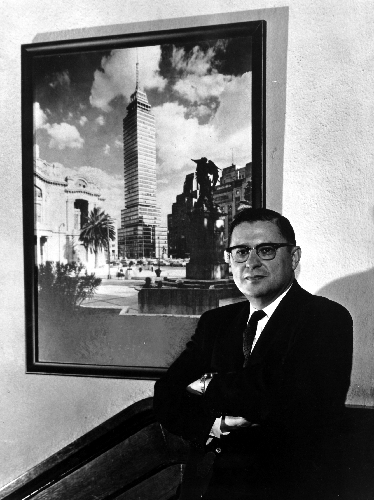
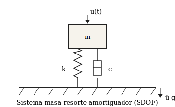

[[section-roman]]

[[toc]]

[[lof]]

[[lot]]

[[loe]]

[[section-arabic]]

::: {.disclosure}
This document is an illustrative example prepared with the assistance of AI; review its content before relying on it.
:::

::: {.callout-note title="About this example"}
This report is a worked example of **epy_reports**, part of the open-source ePy
document suite. Its source — and the sibling examples for epy_slides and
epy_papers — are on GitHub:

- Newmark report (epy_reports):
  <https://github.com/estructuraPy/epy_reports/tree/main/examples/newmark>
- Empire State deck (epy_slides):
  <https://github.com/estructuraPy/epy_slides/tree/main/examples/empire_state_building>
- Brooklyn Bridge paper (epy_papers):
  <https://github.com/estructuraPy/epy_papers/tree/main/examples/brooklyn_bridge>
:::

# Introduction {#sec-intro}


At the beginning of the twentieth century, cities faced earthquakes with almost no technical defense. Earthquakes were interpreted as capricious catastrophes; structures sought to resist by brute stiffness, a strategy the ground disproved with every event. Nathan Mortimore Newmark (1910–1981) led the paradigm shift: from the rigid wall to the **resilient dynamic structure**, capable of **managing the energy** of motion rather than opposing it. As the *Father of Earthquake Engineering* [@vargas2021newmark], his work not only prevented collapses: it gave humanity back the confidence to inhabit a constantly vibrating planet vertically.[^fn-1]

Before Newmark, *seismic design* meant applying a static lateral coefficient of 8 to 10 % of the structure's weight and checking elastic resistance. After Newmark, seismic design came to rely on the response spectrum, on time integration of the dynamic equation of motion, on ductility as a design resource, and on drift verification. That transition was neither gradual nor anonymous: it is sustained by forty years of publications from a single person and from his school at Urbana [@hall1991memoir].


The discussion continues with his education and personal life in @sec-formacion, his professional practice in @sec-profesional, his teaching career in @sec-profesor, the beta method in @sec-metodo, other contributions in @sec-otros, honors and awards in @sec-reconocimientos, and his enduring legacy in @sec-legado.


::: {.callout-important title="Why It Matters"}
The time integration of the beta method and the response spectra of @newmarkHall1982 are the computational foundation of virtually every modern structural analysis software package (SAP2000, ETABS, OpenSees, ANSYS, ABAQUS). When an engineer runs a time-history analysis today, they are executing an algorithm written by Newmark in 1959.
:::


[^fn-1]: The designation "Father of Earthquake Engineering" is widely used in the Spanish-speaking academic community; English-language technical literature prefers "founder of earthquake engineering as an academic discipline" [@hall1991memoir].


[[pagebreak]]

# Life and Education {#sec-formacion}


{#fig-portrait width=40%}

The man in the portrait of @fig-portrait was born on September 22, 1910, in Plainfield, New Jersey, the son of Abraham S. Newmark and Mollie Nathanson [@hall1991memoir]. His mathematical talent manifested early: by the age of 19 he had already completed his bachelor's degree in civil engineering at Rutgers University (1930), earning multiple honors and special prizes that placed him at the top of his graduating class.

His technical maturity was consolidated at the University of Illinois at Urbana-Champaign (UIUC), under the mentorship of three legendary figures: **Hardy Cross** (originator of the moment distribution method), **Harold M. Westergaard**, and **Frank E. Richart** [@hall1991memoir]. He earned his master's degree in 1932 and his doctorate in 1934, both at Urbana. His rise was meteoric: in 1943, at age 33, he was appointed *Research Professor* **bypassing the intermediate rank of associate professor** — an administrative milestone virtually unheard of in American academia.

On a personal level, his life was anchored by his wife **Anne May Cohen** (married 1931) and their three children, Richard, Linda, and Susan. He remained at Urbana throughout his entire professional career: forty-three years on the civil engineering faculty, until his formal retirement in 1976. He died on January 25, 1981, at the age of 70, shortly after having begun to write, together with William J. Hall, the posthumous book *Earthquake Spectra and Design* [@newmarkHall1982].


::: {.callout-note}
It is unusual for an engineer of his stature to have spent his entire career at a single institution. He received constant offers from Berkeley, Stanford, MIT, and Caltech; he declined them all. Urbana was, in his words, *the place where I can work without distractions*.
:::


[[pagebreak]]

# Professional Career {#sec-profesional}


Although an academic by vocation, Newmark maintained an intense consulting practice that fed his research with real-world cases — from wartime service to the most critical civil infrastructure in the Western Hemisphere.


## Wartime Service and Defense {#sec-guerra}


During World War II, Newmark served as a consultant to the *National Defense Research Committee* (NDRC) and the *Office of Scientific Research and Development* (OSRD), part of his service in the Pacific War Zone [@hall1991memoir]. He later contributed to the development of the **Minuteman** and **MX** ballistic missile systems, designing buried silos resistant to nearby nuclear detonation. For these strategic contributions, President Truman awarded him the *President's Certificate of Merit* in 1948.


## The Torre Latinoamericana {#sec-torre}


Newmark's most celebrated consulting project was the Torre Latinoamericana in Mexico City (1956). Together with Adolfo Zeevaert and Leonardo Zeevaert, he designed the first tall building in the world conceived explicitly to resist a magnitude-7.5 earthquake on soft lacustrine soils with low bearing capacity. The strategy combined:

1. A floating box foundation with 361 friction piles.
2. A structural steel rigid frame with double-box columns.
3. A fundamental period tuned to avoid the amplified region of the soft-soil spectrum.

On July 28, 1957, a magnitude-7.7 earthquake with epicenter in Guerrero struck Mexico City. Several buildings collapsed. The Torre Latinoamericana, occupied and fully operational, suffered **not a single structural failure**. The magnitude-8.0 earthquake of 1985, which devastated dozens of buildings, left it unaffected as well.


## Critical Infrastructure {#sec-encargos}


- **BART system** (Bay Area Rapid Transit), San Francisco — seismic design criteria for the rapid transit system connecting Northern California across the most active fault zone in the United States [@hall1991memoir].
- **Trans-Alaska Pipeline** — seismic design of what was at the time the largest private infrastructure project in the world, spanning 1\,287 km across three active fault systems [@hall1991memoir].
- **Sears Tower foundation** (today Willis Tower), Chicago, 1970 — consulting on soil-structure interaction.
- **~70 nuclear power plants** (Atomic Energy Commission) plus multiple **liquefied natural gas (LNG)** facilities during the last seventeen years of his career [@hall1991memoir]. His *Safe Shutdown Earthquake* design criterion still survives in nuclear regulation.


[[pagebreak]]

# The Teacher {#sec-profesor}


What set Newmark apart from the other academics of his generation was his intensity as a doctoral mentor. Between 1934 and 1976 he supervised more than fifty doctoral students. Much of modern structural engineering can be understood as a branch of Newmark's academic genealogical tree:


| Student / collaborator | Principal contribution |
| --- | --- |
| Anestis S. Veletsos | Inelastic behavior [@veletsosNewmark1960] |
| Mete Sözen | Seismic design of reinforced concrete |
| William J. Hall | Design spectra [@newmarkHall1982] |
| William C. Schnobrich | Plate and shell analysis |
| Anil K. Chopra | Modern structural dynamics [@chopra2017dynamics] |
| Emilio Rosenblueth | Co-author of the first seismic engineering text [@newmarkRosenblueth1971] |

: Selected Newmark students and their principal contributions. {#tbl-discipulos}


@tbl-discipulos lists only a fraction of his academic descendants. The course *CE 472 — Structural Dynamics*, which Newmark taught for more than three decades at Urbana, trained entire generations of earthquake engineers on four continents.

Newmark was also a pioneer of **scientific computing** applied to structural engineering. Between 1947 and 1957 he chaired the *Digital Computer Laboratory* at UIUC, where he played a decisive role in the development of the **ILLIAC-II**, one of the first large-scale digital computers in the world [@hall1991memoir]. That effort positioned the university as a world leader in applying computing to structural dynamic analysis — the instrumental foundation that, ten years later, would make the beta method possible. As head of the Department of Civil Engineering from 1956 to 1973, he elevated the institution to an unprecedented level of international prestige.


::: {.callout-tip title="His Teaching Style"}
Hall recalls: *Nathan didn't teach formulas; he taught how to derive them. If a student came to his office with a question about the beta method, they left two hours later with six pages of hand algebra and the conviction that they had deduced it themselves.*
:::


[[pagebreak]]

# The Beta Method {#sec-metodo}


In 1959 Newmark published a 28-page article in the *Journal of the Engineering Mechanics Division* of ASCE that changed dynamic analysis forever: *A Method of Computation for Structural Dynamics* [@newmark1959method]. He proposed a family of single-step time integration algorithms controlled by two parameters $\beta$ and $\gamma$, capable of ranging from explicit to implicit by changing a single number.


## Formulation {#sec-formulacion}


Consider the single-degree-of-freedom (SDOF) system of @fig-sdof, with mass $m$, stiffness $k$, damping $c$, and ground acceleration excitation $\ddot u_{g}(t)$.


{#fig-sdof width=55%}

The equation of motion for the system of @fig-sdof is


$$
m\,\ddot u(t) + c\,\dot u(t) + k\,u(t) = -\,m\,\ddot u_{g}(t)
$$ {#eq-eom}

Newmark proposed the time-domain solution via truncated Taylor-series approximations for the velocity and displacement at step $n+1$:[^fn-2]


$$
\dot u_{n+1} \;=\; \dot u_{n} + \Delta t\,\bigl[ (1-\gamma)\,\ddot u_{n} + \gamma\,\ddot u_{n+1} \bigr]
$$ {#eq-vel}

$$
u_{n+1} \;=\; u_{n} + \Delta t\,\dot u_{n} + \frac{\Delta t^{2}}{2}\,\bigl[ (1-2\beta)\,\ddot u_{n} + 2\beta\,\ddot u_{n+1} \bigr]
$$ {#eq-disp}

@eq-vel and @eq-disp define the beta family. The acceleration at $n+1$ is obtained by substituting into @eq-eom and solving a linear system for $\ddot u_{n+1}$.


[^fn-2]: The complete derivation, with a consistency proof and truncation error estimate, is found in the original article [@newmark1959method, pp. 67–94].


## Classical Variants {#sec-variantes}


Three choices of $(\beta, \gamma)$ are universally recognized:


| Variant | β | γ | Type | Stability |
| --- | --- | --- | --- | --- |
| Average acceleration | 1/4 | 1/2 | Implicit | Unconditionally stable |
| Linear acceleration | 1/6 | 1/2 | Implicit | Stable if $\Delta t / T \leq 0.551$ |
| Central difference | 0 | 1/2 | Explicit | Stable if $\Delta t / T \leq 1/\pi$ |
| Backward difference | 1/2 | 1 | Implicit | Stable, high numerical dissipation |

: Classical variants of the beta method. {#tbl-variantes}


@tbl-variantes summarizes the essential trade-off: average acceleration preserves energy exactly but introduces phase distortion; linear acceleration offers better phase accuracy but requires fine time steps; central difference is explicit — requiring no linear system solve — but its stability limit makes it costly for systems with high-frequency content.


{#fig-beta width=75%}

@fig-beta exposes the physical meaning of $\beta$: it is not an arbitrary number, but the choice of the assumed shape of the acceleration between two consecutive steps. Different values of $\beta$ correspond to different numerical integration rules for $\ddot u(t)$ over $[t_{n},\, t_{n+1}]$. Unconditional stability is achieved when $2\beta \geq \gamma \geq 1/2$.


## Reference Implementation {#sec-codigo}


The algorithmic structure of a single beta-method step for a linear SDOF system is compact:


```python
"""Newmark-beta step for a linear SDOF system."""

def newmark_step(m, c, k, u, v, a, p_next, dt, beta=0.25, gamma=0.5):
    """Advance (u, v, a) by one step under load p_next."""
    k_eff = k + gamma / (beta * dt) * c + m / (beta * dt ** 2)
    A = m / (beta * dt ** 2) + gamma / (beta * dt) * c
    B = m / (beta * dt) + (gamma / beta - 1.0) * c
    C = m * (0.5 / beta - 1.0) + dt * c * (0.5 * gamma / beta - 1.0)
    u_next = (p_next + A * u + B * v + C * a) / k_eff
    v_next = (
        gamma / (beta * dt) * (u_next - u)
        + (1.0 - gamma / beta) * v
        + dt * (1.0 - 0.5 * gamma / beta) * a
    )
    a_next = (
        (u_next - u) / (beta * dt ** 2)
        - v / (beta * dt)
        - (0.5 / beta - 1.0) * a
    )
    return u_next, v_next, a_next
```


This pattern — recasting the dynamic system as a pseudo-static equation with effective stiffness $k^{*}$ and effective load $p^{*}$ — is the canonical form that appears in all modern textbooks [@chopra2017dynamics; @bathe2014fem].


[[pagebreak]]

# Other Contributions {#sec-otros}


::: {.callout-warning title="More Than the Beta Method"}
Reducing Newmark's work to the beta method is unfair. His later contributions in applied seismology and soil mechanics were equally decisive.
:::


## The Sliding Block Method (1965) {#sec-bloque}


In the *Fifth Rankine Lecture* [@newmark1965sliding] Newmark introduced a simple model for estimating the permanent displacement induced by an earthquake on a potentially sliding soil mass or structure. The idea: integrate twice, during intervals in which the acceleration of the record exceeds the critical value $a_{c}$, the equation


$$
\ddot d(t) = \ddot u_{g}(t) - a_{c}\,\operatorname{sgn}\!\bigl( \dot d(t) \bigr)
$$ {#eq-bloque}

@eq-bloque remains, sixty years later, the normative basis for seismic verification of dams, slopes, and retaining walls in virtually every code worldwide. Its continuing relevance is demonstrated in recent studies on the **Bullas (2002)** and **La Paca (2005)** landslides in Murcia, Spain [@rodriguezPeces2011newmark]. That same work highlights an operational lesson: regional-scale assessments (25 m pixels) produce incorrect or null estimates, while 2.5 m per pixel analyses accurately identify the rupture zones — a decisive argument in favor of **high-resolution displacement maps** as a normative product.


## The Newmark-Hall Spectrum {#sec-espectro}


Together with William J. Hall, Newmark consolidated the concept of the **smoothed design spectrum**: given a peak ground acceleration (PGA), a peak ground velocity (PGV), and a peak ground displacement (PGD), three spectral regions (constant acceleration, constant velocity, and constant displacement) are obtained, adjusted by empirical factors that depend on damping. The Newmark-Hall spectrum appeared in its canonical form in [@newmarkHall1982] and dominated seismic design practice for three decades.


## Ductility-Based Design {#sec-ductilidad}


Newmark formalized the two fundamental hypotheses of ductile design:

- **Equal displacement** (long periods $T > T_{c}$): the maximum displacement of the inelastic system equals that of the elastic system with the same initial stiffness.
- **Equal energy** (intermediate periods): the energy absorbed by the inelastic system equals that of the elastic system.

Both hypotheses, derived from simulations with @veletsosNewmark1960, are the foundation of the modern concept of the **response modification factor R** that appears in ASCE 7, Eurocode 8, and most seismic codes worldwide.


[[pagebreak]]

# Awards and Recognition {#sec-reconocimientos}


- ***President's Certificate of Merit*** (1948), awarded by Harry S. Truman, for his service to the NDRC and the OSRD during World War II [@hall1991memoir].
- **Founding member** of the **National Academy of Engineering** (1964), in the first cohort elected when the academy was established [@hall1991memoir].
- **National Medal of Science** (1968), awarded by Lyndon B. Johnson, *for his leadership in creating modern structural engineering based on rational mechanics*.
- *John von Neumann Lecture* (1969), American Society of Mechanical Engineers.
- *Foreign Member of the Royal Society* (1975).
- **Gold Medal of the Institution of Structural Engineers** of the United Kingdom (1980): only **the second American engineer in the institution's 57-year history** to receive it [@hall1991memoir].
- **Norman Medal** of the ASCE on five occasions (an absolute all-time record).
- Honorary doctorates from Princeton, Lehigh, Notre Dame, Liège, and eight additional universities.


# Legacy {#sec-legado}


::: {.callout-caution title="A Discipline, Not a Toolbox"}
Earthquake engineering as an academic discipline — with its own curriculum, its own doctoral programs, and its own journals — did not exist before Newmark. When he died in 1981, it was already unthinkable to design a critical structure without the conceptual machinery he had built.
:::


**Three weeks after** his death in 1981, UIUC renamed its civil engineering building the **Newmark Civil Engineering Laboratory** [@hall1991memoir]. It is the building where approximately one hundred structural engineering doctoral students are trained each year.

The *EERI Distinguished Lecture* has borne his name since 1985 and is awarded annually to the engineer or researcher with the most significant contribution to earthquake engineering in the preceding year.

His two books, *Fundamentals of Earthquake Engineering* [@newmarkRosenblueth1971] and *Earthquake Spectra and Design* [@newmarkHall1982], are still cited, sold, and assigned as required reading in master's and doctoral courses around the world. The second, published a year after his death, was completed by William J. Hall from manuscripts and lecture notes that Newmark himself had left prepared.

As @hall1991memoir summarizes in his *Biographical Memoir* for the National Academy of Sciences, Newmark was *"a university unto himself"* — a man whose technical intuition was balanced by a genuine interest in people. Hall distills his legacy thus:

> *"Almost every practicing structural engineer somewhere in the world uses, daily and unknowingly, an idea of Nathan Newmark. That is, probably, the most honest way to measure his legacy."*


[[pagebreak]]

# References {.unnumbered}


::: {#refs}
:::
