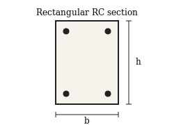

# Introduction {#sec-intro}

This file is a self-contained showcase of epy_mdr. It exercises every
feature that the editor exposes so you can compare the source you are
reading on the left panel with the rendered output on the right. Use
it as a starting template: keep the structure, replace the content.

The tour covers text formatting in @sec-text, mathematics in
@sec-math, figures in @sec-figures, tables in @sec-tables, code in
@sec-code, callouts in @sec-callouts and bibliography handling in
@sec-citations.

> The same Pandoc render is used for the on-screen preview and for the
> PDF, HTML and DOCX exports, so what you see in the preview is what
> you get on disk.

# Text formatting {#sec-text}

Inline emphasis includes **bold**, *italic*, ~~strikethrough~~,
`inline code`, and links to external resources such as
[Pandoc](https://pandoc.org). Paragraphs are separated by a blank
line, exactly as in standard Markdown.

Three list styles are supported:

- Unordered items, with arbitrary nesting
  - Sub-item one
  - Sub-item two
- Back to the top level

1. Ordered items
2. Numbered automatically
3. Independent of the source numbers you type

Task lists track progress:

- [x] YAML front matter
- [x] Cross-references between sections, figures, tables and equations
- [x] Numbered captions in the active language (`lang:` switches to
  Spanish words `Figura`, `Tabla`, `Ecuación`, `Sección`)
- [ ] Replace the placeholder figure with your own image
- [ ] Update the bibliography entries in `sample.bib`

# Mathematics {#sec-math}

Inline math uses single dollar signs, for example $\lambda = k L / r$
with $r = \sqrt{I / A}$. Display math goes between double dollars and
gets an automatic number when you attach an `{#eq-…}` label:

$$
A_{v,\min} \;=\; \max\!\left(
    0.062\,\sqrt{f'_c}\,\frac{b_{w}\,s}{f_{yt}},\;
    0.35\,\frac{b_{w}\,s}{f_{yt}}
\right)
$$ {#eq-avmin}

$$
\delta_{\max} \;=\; \frac{5\,w\,L^{4}}{384\,E\,I}
\qquad\text{at } x = L/2
$$ {#eq-delta}

@eq-avmin is the ACI 318 minimum shear reinforcement; @eq-delta gives
the mid-span deflection of a simply-supported beam under uniform load.
Both equations are referenced again later in @sec-citations.

# Figures {#sec-figures}

The figure below is a small SVG bundled next to this document so the
preview always works after you clone the repo. Replace
`sample_diagram.svg` with your own asset when you start writing.

{#fig-section width=55%}

The cross-section in @fig-section is intentionally generic: it is the
geometric backdrop for every formula in @sec-math.

# Tables {#sec-tables}

| #   | Load combination                          | Governs                |
| --- | ------------------------------------------ | ---------------------- |
| 1   | $1.4\,D$                                   | Pure gravity           |
| 2   | $1.2\,D + 1.6\,L + 0.5\,(L_{r},S,R)$       | Live load              |
| 3   | $1.2\,D + 1.6\,(L_{r},S,R) + (L,\,0.5W)$   | Roof live / snow       |
| 4   | $1.2\,D + 1.0\,W + L + 0.5\,(L_{r},S)$     | Wind                   |
| 5   | $0.9\,D + 1.0\,W$                          | Wind uplift            |
| 6   | $1.2\,D + 1.0\,E + L + 0.2\,S$             | Seismic                |
| 7   | $0.9\,D + 1.0\,E$                          | Seismic overturning    |

: Strength-design load combinations (ASCE 7). {#tbl-loads}

| Material           | $f'_c$ / $f_y$ | $E$ (GPa) | $\nu$ | $\gamma$ (kN/m³) |
| ------------------ | -------------- | --------: | ----: | ---------------: |
| Concrete C25       | 25 MPa         |      25.0 |  0.20 |             24.0 |
| Concrete C35       | 35 MPa         |      28.5 |  0.20 |             24.0 |
| Rebar A615 Gr.60   | 420 MPa        |     200.0 |  0.30 |             77.0 |
| Steel A36          | 250 MPa        |     200.0 |  0.30 |             77.0 |
| Steel A992         | 345 MPa        |     200.0 |  0.30 |             77.0 |

: Nominal material properties. {#tbl-materials}

@tbl-loads is the seven-combination ASCE 7 strength-design set;
@tbl-materials collects the material constants used by @eq-avmin.

# Code {#sec-code}

Fenced code blocks render with Pandoc's tango syntax highlighter and
preserve indentation:

```python
"""Compute the ACI 318 minimum shear reinforcement area."""

def av_min(fc: float, fyt: float, bw: float, s: float) -> float:
    """Return A_v,min in mm^2 for a rectangular cross-section."""
    a = 0.062 * fc ** 0.5 * bw * s / fyt
    b = 0.35 * bw * s / fyt
    return max(a, b)


if __name__ == "__main__":
    print(f"A_v,min = {av_min(28, 420, 300, 200):.1f} mm^2")
```

Shell snippets use a `bash` tag:

```bash
pip install -e ".[build]"
python build.py
```

# Callouts {#sec-callouts}

All five Quarto callout kinds are available through the
*Insert > Callout* menu (`Ctrl+Shift+C` for the default `note` variant).

::: {.callout-note title="Note"}
Use callouts for context that complements the main flow without
interrupting it.
:::

::: {.callout-tip title="Pro tip"}
Press `Ctrl+P` from this tab to export the current view as a PDF — the
print stylesheet adapts margins, fonts and code blocks automatically.
:::

::: {.callout-warning title="Range of validity"}
The formulas in @sec-math assume linear-elastic behaviour and a
rectangular cross-section. Always check the limits of an empirical
expression before applying it.
:::

::: {.callout-important title="Read this first"}
The minimum shear reinforcement in @eq-avmin is the **larger** of the
two expressions inside the `max(…)` — never the average and never
rounded down.
:::

::: {.callout-caution title="Safety critical"}
A wrong shear-reinforcement detail can trigger a brittle failure with
no warning; the wind-induced collapse of the Tacoma Narrows bridge in
1940 is a classical reminder [@tacoma1941collapse].
:::

# Citations {#sec-citations}

Citations use the Quarto / Pandoc syntax `@key` and are resolved by
citeproc against the `bibliography:` field declared in the YAML
header. The famous remark from @box1987empirical applies as much to
empirical models as it does to design formulas: *"All models are
wrong, but some are useful."* The minimum-shear expression
[@aci318min] in @eq-avmin is a good example — it is calibrated, not
derived from first principles, and it lives or dies with the
experimental envelope it was fit to.

# References {.unnumbered}

::: {#refs}
:::
