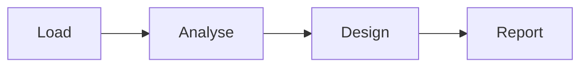

Welcome to **epy_reports**, a Quarto/Markdown editor with live preview and
one-click PDF export. This document is both a demo and a manual: every
section shows the *syntax* in a code block and the *rendered result* right
below it. Edit freely, then export with `Ctrl+P` to see it as a PDF.

{#fig-editor width=100%}

[[toc]]

[[lof]]

[[lot]]

[[loe]]

[[pagebreak]]

# Quick start

| Action | Shortcut |
| --- | --- |
| New / open / save | `Ctrl+N` / `Ctrl+O` / `Ctrl+S` |
| Heading H1–H6 (0 clears) | `Ctrl+1` … `Ctrl+6` / `Ctrl+0` |
| Bold / italic / inline code | `Ctrl+B` / `Ctrl+I` / `Ctrl+E` |
| Link | `Ctrl+K` |
| Figure / table / equation | `Ctrl+Shift+F` / `Ctrl+Shift+T` / `Ctrl+Shift+Q` |
| Callout / code block / checklist | `Ctrl+Shift+C` / `Ctrl+Shift+K` / `Ctrl+Shift+L` |
| Two-column block / Three-column block | `Ctrl+Shift+2` / `Ctrl+Shift+3` |
| Footnote / page break | `Ctrl+Shift+O` / `Ctrl+Shift+G` |
| Cross-reference / citation picker | `Ctrl+R` / `Ctrl+Shift+B` |
| Document properties (cover/header/footer) | `Ctrl+Shift+Y` |
| Export PDF / HTML / DOCX | `Ctrl+P` / `Ctrl+Shift+P` / `Ctrl+Shift+D` |

: Keyboard shortcuts. {#tbl-shortcuts}

You can also drag-and-drop `.md`, `.markdown` or `.qmd` files onto the
window — each opens in its own tab.

# Front matter

A document starts with an optional YAML block between two `---` lines. It
drives the title block, bibliography, page layout and cover page:

```yaml
---
title: My Report
subtitle: An optional subtitle
author: Your Name
date: 2026-06-18
lang: en            # en or es — localizes "Figure"/"Figura", etc.
page-size: letter   # letter | a4 | legal
footer: "Confidential — Acme Inc."
copyright: "© 2026 Acme Inc."   # embedded in the exported PDF metadata
page-numbers: true  # stamp "Page X of Y" on every content page
cover: true         # render a dedicated cover page
logo: logo.png      # cover logo (relative to the document)
watermark: mark.png # faint grayscale image drawn behind every page
header: ["Acme", "Report", "2026", "", "Rev. B", "p."]  # up to 6 cells
bibliography: refs.bib   # enables @citations
csl: ieee           # citation style: ieee | apa | chicago | ...
---
```

Only the keys you need are required; everything is optional.

::: {.callout-tip title="Fill this in from a form"}
You don't have to type the YAML by hand. Open *Document ▸ Document
properties…* (`Ctrl+Shift+Y`) for a form that edits the title block, the
cover page, the running header cells, the footer, page numbers and page
size, and writes them into the front matter for you.
:::

{#fig-properties width=75%}

# Text formatting

**Insert it:** select the text, then use the *Text* menu — `Ctrl+B` (bold),
`Ctrl+I` (italic), `Ctrl+E` (inline code) or `Ctrl+K` (link).

```markdown
**bold**, *italic*, `inline code`, ~~strikethrough~~ and a
[link](https://anmingenieria.com).
```

**bold**, *italic*, `inline code`, ~~strikethrough~~ and a
[link](https://anmingenieria.com).

# Headings and sections

**Insert it:** *Text ▸ Heading* sets the level on the current line
(`Ctrl+1`…`Ctrl+6`; `Ctrl+0` clears it). For a labelled, cross-referenceable
section, use *Elements ▸ Section*.

Prefix a line with one to six `#` characters. Add a `{#sec-...}` label to
make the heading a cross-reference target:

```markdown
## Methodology {#sec-method}
```

# Lists and checklists

**Insert it:** type the list markers directly, or use *Elements ▸ Checklist*
(`Ctrl+Shift+L`) for a task list — the dialog asks for the number of items
and an optional bold title.

{width=55%}

```markdown
- Unordered item
  - Nested item
1. Ordered item
2. Second item

- [x] Completed task
- [ ] Pending task
```

- Unordered item
    - Nested item
1. Ordered item
2. Second item

- [x] Completed task
- [ ] Pending task

::: {.callout-tip title="Interactive in HTML"}
In the **HTML** export the task-list checkboxes are live — readers can tick
and untick them in the browser. In the PDF they print as static boxes.
:::

# Column blocks

**Insert it:** *Elements ▸ Two-column block* (`Ctrl+Shift+2`) or *Elements ▸
Three-column block* (`Ctrl+Shift+3`). A dialog lets you adjust the column
widths before the block is inserted; the default split is 50/50 for two
columns and 33/33/34 for three.

Column blocks use Pandoc fenced-div syntax — a `:::: {.columns}` outer fence
with one `::: {.column width="…"}` inner div per column. The CSS `display:flex`
rule in the exported HTML and PDF keeps the columns side by side:

```markdown
:::: {.columns}
::: {.column width="50%"}
**Left column**

Put any content here — text, a table, a code block, a callout.
:::
::: {.column width="50%"}
**Right column**

The two panels sit side by side in HTML and PDF output.
:::
::::
```

:::: {.columns}
::: {.column width="50%"}
**Left column**

Put any content here — text, a table, a code block, a callout.
:::
::: {.column width="50%"}
**Right column**

The two panels sit side by side in HTML and PDF output.
:::
::::

A three-column block follows the same pattern with three inner divs:

```markdown
:::: {.columns}
::: {.column width="33%"}
Column A
:::
::: {.column width="33%"}
Column B
:::
::: {.column width="34%"}
Column C
:::
::::
```

::: {.callout-tip title="Flexible widths"}
You are not limited to equal splits. The dialog accepts any integer
percentages that add up to 100, so a 30/70 layout is just as easy.
:::

# Quotes and callouts

**Insert it:** *Elements ▸ Callout* (`Ctrl+Shift+C`), then pick the type
(note / tip / warning / important / caution) and an optional title.

A blockquote uses `>`; callouts use a fenced `::: {.callout-...}` block.
The five callout types are `note`, `tip`, `warning`, `important` and
`caution`, each with an optional `title`:

```markdown
> A plain blockquote.

::: {.callout-note title="Heads up"}
Body of the callout.
:::
```

> A plain blockquote.

::: {.callout-note title="Note"}
General information worth highlighting.
:::

::: {.callout-tip title="Tip"}
A helpful suggestion.
:::

::: {.callout-warning title="Warning"}
Something to be careful about.
:::

::: {.callout-important title="Important"}
Critical information you must not miss.
:::

::: {.callout-caution title="Caution"}
Proceed carefully — this can have consequences.
:::

# Code blocks

**Insert it:** *Elements ▸ Code block* (`Ctrl+Shift+K`) and choose the
language.

Fence code with triple backticks and an optional language for syntax
highlighting:

````markdown
```python
def greet(name: str) -> str:
    return f"Hello, {name}!"
```
````

```python
def greet(name: str) -> str:
    return f"Hello, {name}!"
```

# Tables

**Insert it:** *Elements ▸ Table* (`Ctrl+Shift+T`) — set the columns, rows,
header and caption; the reference id is filled in for you.

{width=50%}

A pipe table with a caption line (`: Caption {#tbl-id}`) becomes a
numbered, cross-referenceable table:

```markdown
| Material | f'c (MPa) | E (GPa) |
| --- | --- | --- |
| Concrete | 28 | 25 |
| Steel | — | 200 |

: Material properties. {#tbl-materials}
```

| Material | f'c (MPa) | E (GPa) |
| --- | --- | --- |
| Concrete | 28 | 25 |
| Steel | — | 200 |

: Material properties. {#tbl-materials}

# Figures

Point an image at a caption and give it a `{#fig-...}` label and an
optional width. The figure is auto-numbered and cross-referenceable:

```markdown
{#fig-stress width=60%}
```

**Insert it:** *Elements ▸ Figure* (`Ctrl+Shift+F`) — the editor copies the
chosen image next to your document and fills in the label for you. Use
*Elements ▸ Image* for a plain image with no caption.

{width=55%}

# Equations

**Insert it:** *Elements ▸ Equation* (`Ctrl+Shift+Q`) — type the LaTeX and a
reference id; the equation is auto-numbered.

{width=65%}

Inline math goes between single `$`; display equations between `$$`, with
an optional `{#eq-...}` label:

```markdown
The base shear is $V = C_s W$. Newmark's update reads

$$
u_{n+1} = u_n + \Delta t\,\dot u_n
        + \tfrac{\Delta t^2}{2}\,[(1-2\beta)\,\ddot u_n + 2\beta\,\ddot u_{n+1}]
$$ {#eq-newmark}
```

The base shear is $V = C_s W$. Newmark's update reads

$$
u_{n+1} = u_n + \Delta t\,\dot u_n
        + \tfrac{\Delta t^2}{2}\,[(1-2\beta)\,\ddot u_n + 2\beta\,\ddot u_{n+1}]
$$ {#eq-newmark}

# Cross-references and citations

**Insert it:** open the cross-reference picker with `Ctrl+R` and choose any
labelled element; for a bibliography citation use the *References* menu
(`Ctrl+Shift+B`), which needs a linked `.bib`.

{width=55%}

Reference any labelled element with `@` plus its id; the number and the
localized word ("Table", "Equation", …) are filled in automatically:

```markdown
See @tbl-materials, @eq-newmark and @sec-method.
```

See @tbl-shortcuts and @eq-newmark — the links above are live.

With a `bibliography:` declared in the front matter, cite sources the same
way and the reference list is appended automatically (Pandoc citeproc):

```markdown
As shown by Newmark [@newmark1959method], the method is unconditionally
stable for $\beta \geq 1/4$.
```

{width=60%}

# Footnotes

**Insert it:** *Elements ▸ Footnote* (`Ctrl+Shift+O`) — it drops the marker
and a matching definition stub for you to fill in.

{width=60%}

Drop a marker `[^id]` in the text and define it anywhere; on PDF export the
note is placed at the *foot of the page* where it is referenced:

```markdown
Confined concrete gains ductility[^fn-ductility].

[^fn-ductility]: Ductility is the capacity to deform inelastically
    without losing strength.
```

Confined concrete gains ductility[^fn-ductility].

[^fn-ductility]: Ductility is the capacity to deform inelastically without
    losing strength.

# Page layout markers

**Insert it:** use *Elements ▸ Page break* (`Ctrl+Shift+G`) and
*Elements ▸ Indexes*, or type any of these markers on their own line:

| Marker | Effect |
| --- | --- |
| `[[toc]]` | Table of contents |
| `[[lof]]` | List of figures |
| `[[lot]]` | List of tables |
| `[[loe]]` | List of equations |
| `[[pagebreak]]` | Force a new page |
| `[[section-roman]]` | Section break; the pages that follow number i, ii, iii… |
| `[[section-arabic]]` | Section break; the pages that follow number 1, 2, 3… |

: Layout markers. {#tbl-markers}

Index entries (`[[toc]]`/`[[lof]]`/`[[lot]]`/`[[loe]]`) show the page
number of their target in the exported PDF.

**Section numbering.** A section break both forces a new page and
restarts the page numbering in the chosen style. Use `[[section-roman]]`
for front matter (a preface or the indexes) so it numbers i, ii, iii, and
`[[section-arabic]]` where the body begins so it restarts at 1 — the
classic academic convention. Insert them from *Elements ▸ Section break
(Roman / Arabic)*.

# Diagrams

**Insert it:** *Elements ▸ Diagram ▸ Mermaid / nomnoml* drops a fenced code
block you fill with the diagram source. Both engines read the active theme's
colours, so a diagram always matches the document.

Fence the source with the engine name. **Mermaid** draws flowcharts,
sequences and more:

````markdown

````


**nomnoml** draws UML-style component diagrams:

````markdown
```nomnoml
[Document] -> [Section]
[Section] -> [Figure]
[Section] -> [Table]
```
````

```nomnoml
[Document] -> [Section]
[Section] -> [Figure]
[Section] -> [Table]
```

::: {.callout-note title="Where they render"}
Diagrams render in the live preview, the HTML export and the PDF, and the
Word (.docx) export rasterizes each one to a themed image so the document
keeps the picture.
:::

# Design components

Beyond prose, a set of theme-driven layout components turn a plain list into
a designed block. Each is a fenced `::: {.class}` div coloured from the
active theme.

**Cards** — a responsive grid of titled panels:

```markdown
:::: {.cards}
::: {.card}
#### Strength
Characteristic value with partial factors applied.
:::
::: {.card}
#### Stiffness
Serviceability deflection within limits.
:::
::::
```

:::: {.cards}
::: {.card}
#### Strength
Characteristic value with partial factors applied.
:::
::: {.card}
#### Stiffness
Serviceability deflection within limits.
:::
::::

**Big numbers** — a row of headline figures with labels:

```markdown
:::: {.stats}
::: {.stat}
**28 MPa**

[concrete strength]{.stat-label}
:::
::::
```

:::: {.stats}
::: {.stat}
**28 MPa**

[concrete strength]{.stat-label}
:::
::: {.stat}
**200 GPa**

[steel modulus]{.stat-label}
:::
::::

**Timeline** — a vertical sequence of milestones:

```markdown
::: {.timeline}
- **Phase 1** — Site investigation
- **Phase 2** — Structural design
- **Phase 3** — Construction
:::
```

::: {.timeline}
- **Phase 1** — Site investigation
- **Phase 2** — Structural design
- **Phase 3** — Construction
:::

# Exporting

| Format | Shortcut | Engine |
| --- | --- | --- |
| PDF | `Ctrl+P` | Paged.js + Qt (footnotes at page foot, themed margins) |
| HTML | `Ctrl+Shift+P` | self-contained, theme CSS embedded |
| Word (.docx) | `Ctrl+Shift+D` | Pandoc, per-theme reference document |

: Export formats. {#tbl-export}

For publication-quality layouts, *Export ▸ Export via epy_docs…* renders
through the commercial epy_docs backend (ANM Ingeniería).

# Python API — using epy_reports without the interface

Everything the editor does is available programmatically, so you can wire
epy_reports into your own Python pipeline (batch jobs, web services, CI).

## Markdown → HTML (no GUI, no Qt)

`render_markdown` is pure Python (Pandoc under the hood) and returns a
complete, self-contained HTML document:

```python
from pathlib import Path
from epy_reports.renderer import render_markdown
from epy_reports import themes

source = Path("report.md").read_text(encoding="utf-8")
html = render_markdown(
    source,
    base_dir=Path("."),          # resolves relative images/links
    theme_css=themes.get("technical").to_css(),
    page_size="letter",
)
Path("report.html").write_text(html, encoding="utf-8")
```

## Themes

```python
from epy_reports import themes

print(list(themes.THEMES))          # the 9 theme ids
css = themes.get("academic").to_css()   # ":root { … }" override block
bg = themes.get("academic").css_vars["bg"]   # page background color
```

## Markdown → PDF (needs Qt WebEngine)

PDF export paginates with Paged.js inside Qt WebEngine, so it needs a
`QApplication`. The reference implementation is
`tutorials/newmark/render_all_themes.py`: render with
`render_markdown(..., for_export=True)`, load the HTML into an offscreen
`QWebEngineView` (`WA_DontShowOnScreen`), wait for `window._paged_done`,
then call `page.printToPdf(...)` with **zero** page margins.

## Stamping an existing PDF (no GUI, no Qt)

The footer, header and page-background helpers are pure `pypdf` +
`reportlab` and work on any PDF:

```python
from pathlib import Path
from epy_reports._pdf_footer import add_page_background, add_footer, add_header

pdf = Path("report.pdf")
add_page_background(pdf, "#F0F5FA")                 # full-sheet tint
add_header(pdf, ["Acme", "Report", "2026"])         # up to 6 cells
add_footer(pdf, "Confidential", page_numbers=True, lang="en")
```

## Rendering through epy_docs (optional commercial backend)

```python
from pathlib import Path
from epy_reports.docs_bridge import epy_docs_available, render_document

if epy_docs_available():
    render_document(
        source_path=Path("report.qmd"),
        layout="corporate",
        document_type="report",
        output_dir=Path("out"),
        pdf=True, html=True,
    )
```

# Themes

Switch the editor and preview theme from the *View* menu — nine layouts
are bundled: academic, classic, corporate, creative, handwritten, minimal,
professional, scientific and technical. The chosen theme styles both the
on-screen preview and every export.

**Make your own.** *View ▸ Theme ▸ New theme…* opens a theme editor: clone
any bundled theme as a starting point, then adjust the base colors, the
text and code fonts, the h1–h6 typography scale and the five callout
colors — with a live preview. Everything else (the toolbar palette,
syntax-highlighting colors, contrast) is derived automatically, so a few
choices yield a coherent identity. Saved themes appear next to the
built-in ones in *View ▸ Theme* and persist across sessions; edit or
remove them from the same menu.

{width=80%}

---

*epy_reports · Ing. Angel Navarro-Mora M.Sc. · ANM Ingeniería · MIT license*
